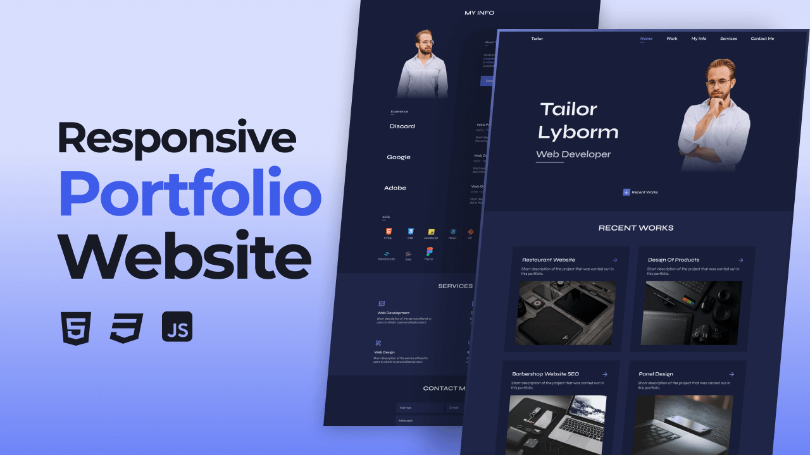

# Responsive Portfolio Website - Tailor Lyborm

A responsive, modern personal portfolio website built with HTML, CSS, and JavaScript. Originally designed by [Bedimcode](https://www.youtube.com/@Bedimcode) and completed for seamless local use.



## 🚀 How to Run Locally

You have multiple easy options to run this project on Windows:

### Option 1: Direct File Launch (Quickest)
Simply double-click `start.bat` or open `index.html` directly in any web browser (Google Chrome, Microsoft Edge, Firefox, Brave).

### Option 2: Built-in Local HTTP Server (Recommended)
1. Double-click `start-server.bat` (or run `.\start-server.ps1` in PowerShell).
2. It automatically hosts the website at `http://localhost:8080/` and opens your browser.
3. Press `Ctrl+C` in the terminal window when you wish to stop the server.

### Option 3: VS Code Live Server
If you use Visual Studio Code, install the **Live Server** extension, right-click `index.html`, and click **Open with Live Server**.

---

## ✨ Features Included

- **Mobile First Responsive Design**: Perfectly styled for mobile devices, tablets, and wide desktop screens.
- **Modern Dark Theme**: Deep slate/navy aesthetic with accent highlights.
- **Glassmorphism Header**: Header blurs softly on scroll using `backdrop-filter`.
- **Smooth Navigation & Scrollspy**: Active links update automatically as you scroll down the page.
- **Interactive Portfolio Cards**: Showcase for recent works with hover animations.
- **My Info Section**: About bio, downloadable CV (`Tailor-Cv.pdf`), career timeline, and skills grid with vector badges.
- **Services Grid**: Highlighted key service offerings.
- **Working Contact Form**: Built with input validation and local simulated feedback (`Message sent successfully ✅`), ready for your EmailJS credentials.
- **Scroll to Top**: Floating return-to-top button.
- **ScrollReveal Animations**: Staggered scroll animations.

---

## 🎨 Customization

### Changing the Primary Color
In [assets/css/styles.css](assets/css/styles.css), change the `--hue` variable at the top of `:root`:
```css
:root {
  /*
    Default: 230 (Royal Blue)
    Purple: 245 | Blue: 210 | Pink: 340 | Green: 162 | Orange: 14
  */
  --hue: 230;
}
```

### Configuring EmailJS for Real Emails
In [assets/js/main.js](assets/js/main.js), replace the placeholder keys in `sendEmail`:
```javascript
const serviceID = 'YOUR_SERVICE_ID'
const templateID = 'YOUR_TEMPLATE_ID'
const publicKey = 'YOUR_PUBLIC_KEY'
```
